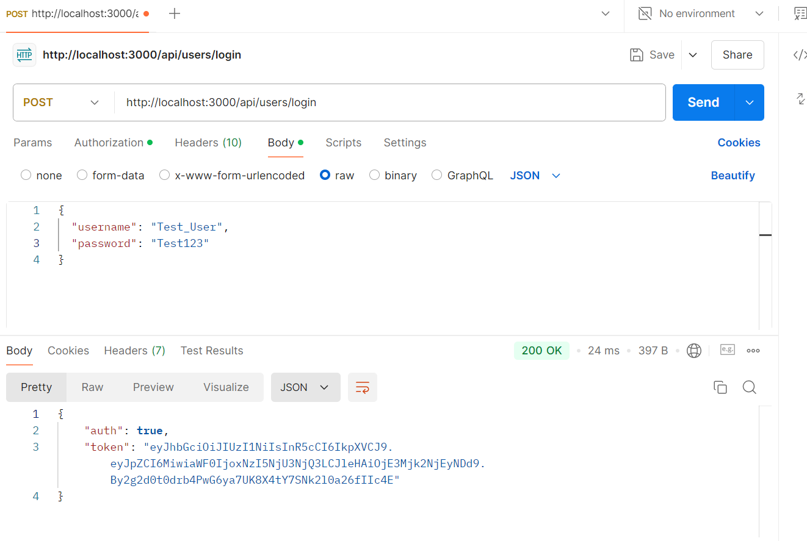
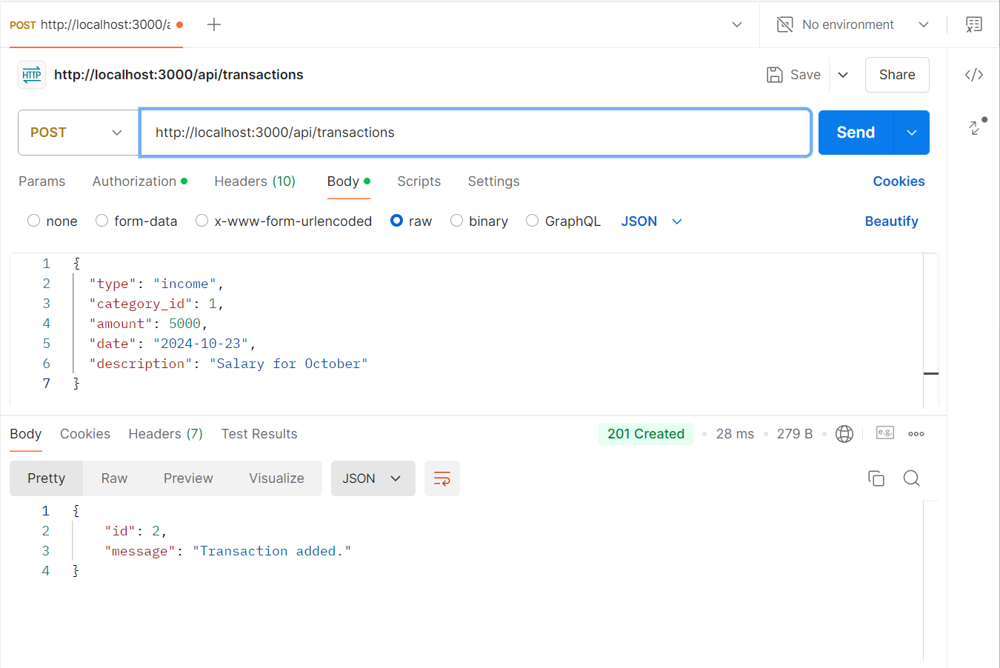
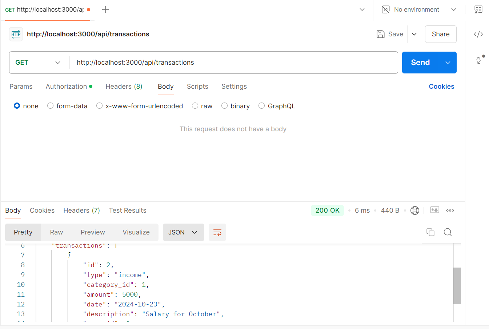
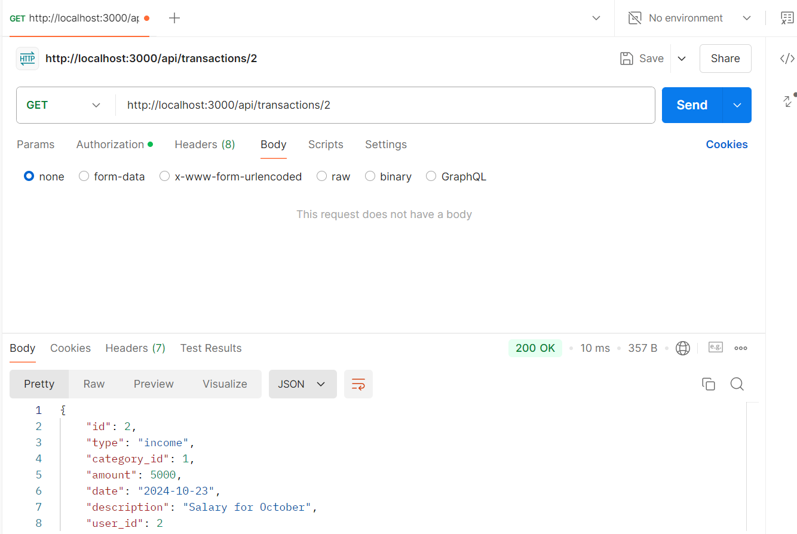
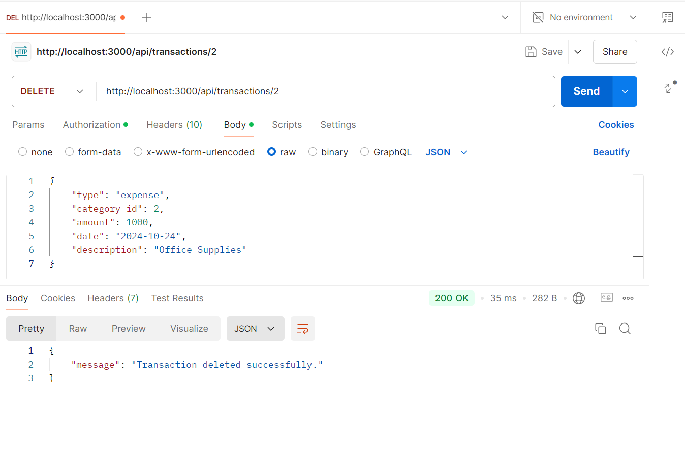
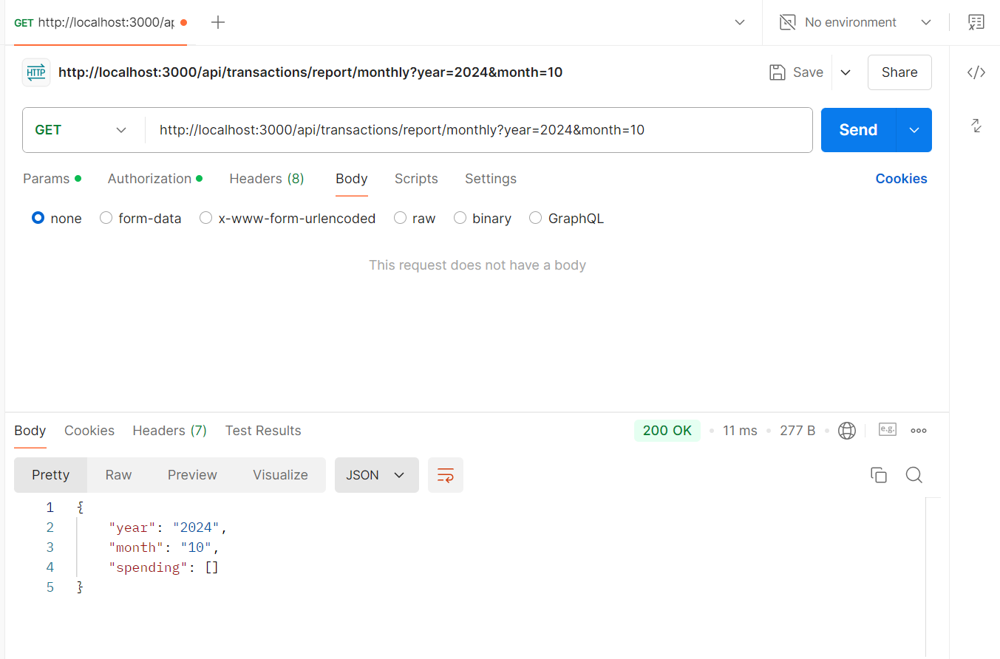
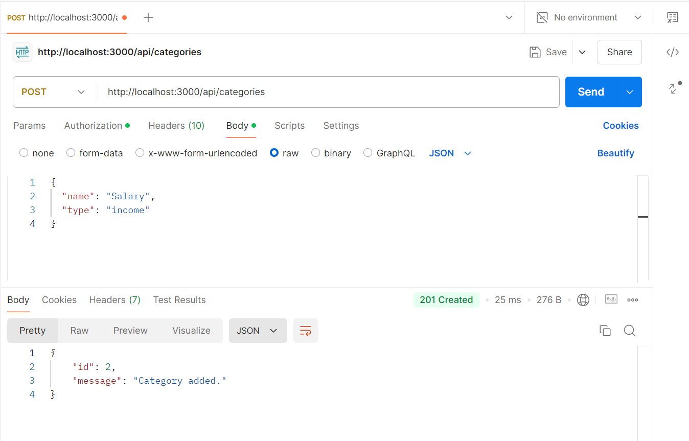
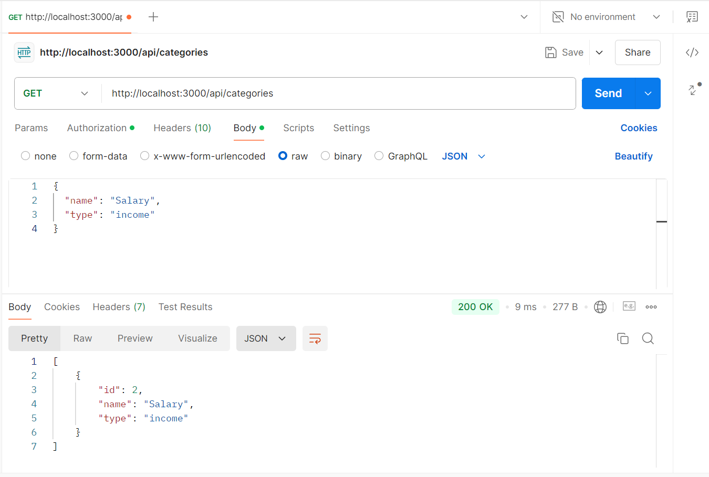
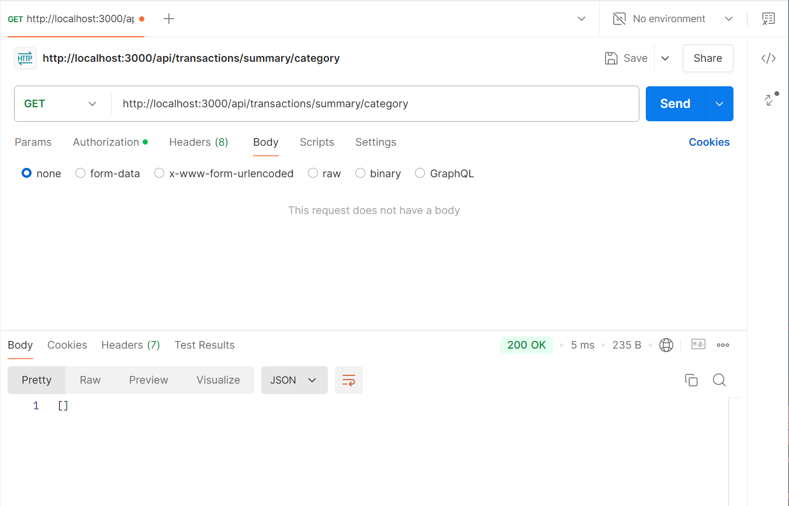

# Expense Tracker Backend

A RESTful API for managing personal financial records, allowing users to track income and expenses, generate reports, and authenticate users.

## Table of Contents
- [Setup Instructions](#setup-instructions)
- [API Documentation](#api-documentation)
  - [User Registration](#user-registration)
  - [User Login](#user-login)
  - [Add Transaction](#add-transaction)
  - [Get User Transactions](#get-user-transactions)
  - [Get Transaction by ID](#get-transaction-by-id)
  - [Update Transaction by ID](#update-transaction-by-id)
  - [Delete Transaction by ID](#delete-transaction-by-id)
  - [Get Monthly Spending by Category](#get-monthly-spending-by-category)
  - [Add Category](#add-category)
  - [Get Categories](#get-categories)
  - [Get Transaction Summary by Category](#get-transaction-summary-by-category)

## Setup Instructions

1. **Clone the repository**:
   git clone 
   cd Expense-Tracker-Backend

## Install dependencies:
    npm install

## Run the application:
    npm start
    The server will start on http://localhost:PORT, where PORT is typically 3000.

## For Development:
    npm run dev 
    The server will start on http://localhost:PORT, where PORT is typically 3000.

## API Documentation

## 1. User Registration
## Endpoint: POST /api/users/register

Request Body:
{
  "username": "john_doe",
  "password": "securepassword"
}

Response:
{
  "message": "User registered successfully."
}

## 2. User Login
## Endpoint: POST /api/users/login

Request Body:
{
  "username": "john_doe",
  "password": "securepassword"
}

Response:
{
  "auth": true,
  "token": "your_jwt_token_here"
}

## 3. Add Transaction
## Endpoint: POST /api/transactions

Headers:
{
  "x-access-token": "your_jwt_token_here"
}

Request Body:
{
  "type": "income",
  "category_id": 1,
  "amount": 5000,
  "date": "2024-10-23",
  "description": "Salary for October"
}

Response:
{
  "message": "Transaction added successfully."
}

## 4. Get User Transactions
## Endpoint: GET /api/transactions

Headers:
{
  "x-access-token": "your_jwt_token_here"
}

Response:
{
  "currentPage": 1,
  "totalPages": 4,
  "limit": 10,
  "totalTransactions": 20,
  "transactions": [
    {
      "id": 1,
      "type": "income",
      "category_id": 1,
      "amount": 5000,
      "date": "2024-10-23",
      "description": "Salary for October",
      "user_id": 1
    }
  ]
}

## 5. Get Transaction by ID
## Endpoint: GET /api/transactions/:id

Headers:
{
  "x-access-token": "your_jwt_token_here"
}

Example Request:
GET /api/transactions/1

Response:
{
  "id": 1,
  "type": "income",
  "category_id": 1,
  "amount": 5000,
  "date": "2024-10-23",
  "description": "Salary for October",
  "user_id": 1
}

## 6. Update Transaction by ID
## Endpoint: PUT /api/transactions/:id
Headers:
{
  "x-access-token": "your_jwt_token_here"
}

Example Request:
PUT /api/transactions/1

Request Body:
{
  "type": "expense",
  "category_id": 2,
  "amount": 1000,
  "date": "2024-10-24",
  "description": "Office Supplies"
}

Response:
{
  "message": "Transaction updated successfully."
}

## 7. Delete Transaction by ID
## Endpoint: DELETE /api/transactions/:id

Headers:
{
  "x-access-token": "your_jwt_token_here"
}

Example Request:
DELETE /api/transactions/1

Response:
{
  "message": "Transaction deleted successfully."
}

## 8. Get Monthly Spending by Category
## Endpoint: GET /api/transactions/report/monthly

Query Parameters: year and month

Headers:
{
  "x-access-token": "your_jwt_token_here"
}

Example Request:
GET /api/transactions/report/monthly?year=2024&month=10

Response:
{
  "year": "2024",
  "month": "10",
  "spending": [
    {
      "category": "Groceries",
      "total": 300
    },
    {
      "category": "Transport",
      "total": 150
    }
  ]
}

## 9. Add Category
## Endpoint: POST /api/categories

Headers:
{
  "x-access-token": "your_jwt_token_here"
}

Request Body:
{
  "name": "Salary",
  "type": "income"
}

Response:
{
  "message": "Category added successfully."
}

## 10. Get Categories
## Endpoint: GET /api/categories

Headers:
{
  "x-access-token": "your_jwt_token_here"
}

Response:
[
  {
    "id": 1,
    "name": "Salary",
    "type": "income"
  }
]

## 11. Get Transaction Summary by Category
## Endpoint: GET /api/transactions/summary/category
Headers:
{
  "x-access-token": "your_jwt_token_here"
}

Response:
[
  {
    "name": "Salary",
    "total": 5000
  }
]

## Conclusion
This API provides a complete solution for managing personal finance, allowing users to track their income and expenses, generate reports, and categorize their transactions efficiently. For further enhancements, consider implementing additional features such as expense alerts, recurring transactions, or visualizations.